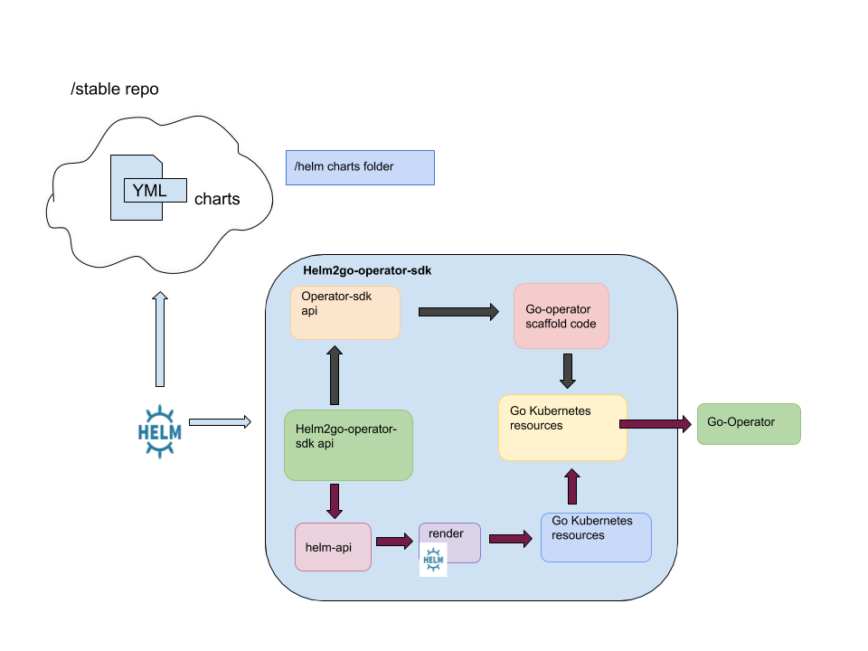

## Design

### Render
Render handles the primary steps in the Helm to Go Kubernetes pathway. The main responsibility of this package is to render valid Helm charts. Additionally, the package can write the injected files to a specified temp directory.

### Convert
Convert handles the secondary steps in the Helm to Go Kubernetes pathway. The main responsibility of this package is the unmarshal the rendered YAML files and produce raw Kubernetes resources.

The file `pkg/convert/convert.go` contains the main logic to accomplish the conversion itself. `YAMLUnmarshalResources` receives an absolute path to a directory and simply unmarshals all resource files one at a time.